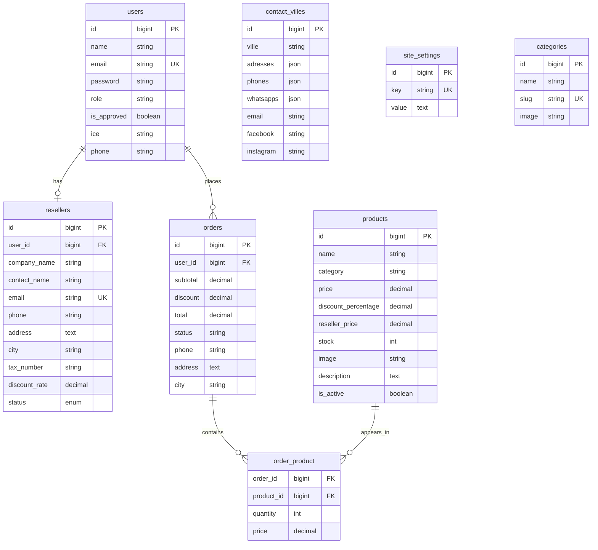
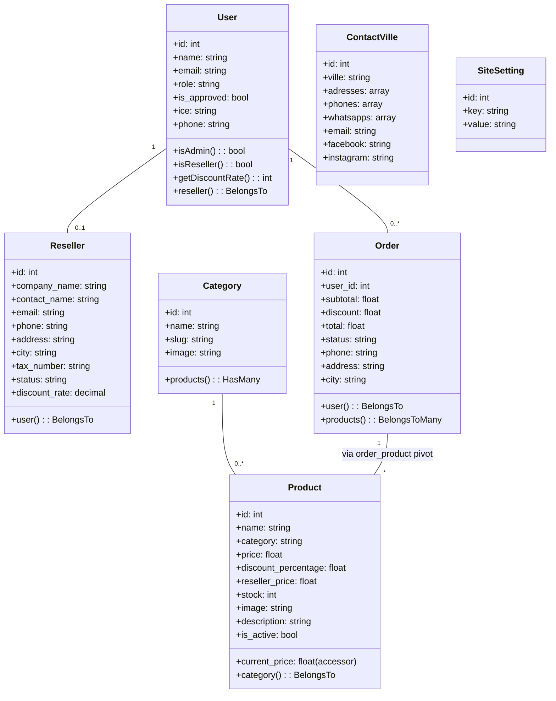
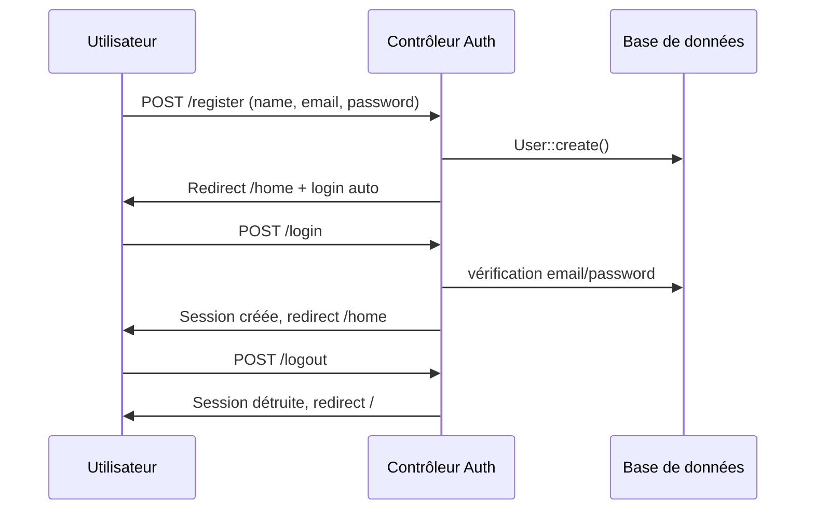

Voici un fichier **README.md** complet contenant un rapport technique avec les diagrammes de classes (format Mermaid), l'analyse de l'architecture et les explications des composants clés de votre application Laravel.

```markdown
# 📦 Application Total Tools Maroc – Rapport d'architecture

## 1. Vue d'ensemble

L'application est une plateforme e-commerce B2B/B2C développée avec **Laravel 11** + **React (Inertia.js)**.  
Elle permet :

- La gestion de produits (avec prix public, prix revendeur, remise).
- Un système d'authentification multi‑rôles : **utilisateur simple**, **revendeur (reseller)** et **administrateur**.
- La gestion des commandes avec calcul automatique des remises.
- Un back‑office complet pour administrer produits, commandes, demandes de revendeurs, paramètres de contact et points de vente.

---

## 2. Schéma de la base de données (relations principales)



---

## 3. Diagramme de classes (UML simplifié)

Les diagrammes suivants sont exprimés en **Mermaid** et représentent les modèles principaux et leurs relations.

### 3.1 Modèles Eloquent



### 3.2 Contrôleurs principaux (extrait)

```mermaid
classDiagram
    class ProductController {
        +index()
        +create()
        +edit(Product $product)
        +store(Request $request)
        +update(Request $request, Product $product)
        +destroy(Product $product)
    }
    class AdminOrderController {
        +index()
        +updateStatus(Request $request, Order $order)
        +destroy(Order $order)
    }
    class AdminResellerController {
        +index()
        +approve(Request $request, Reseller $reseller)
        +reject(Reseller $reseller)
    }
    class OrderController {
        +userOrders()
        +show(Order $order)
        +index() // checkout page
        +store(Request $request)
        +thanks($id)
    }
    class ResellerController {
        +index()
        +store(Request $request)
    }
    class ContactVilleController {
        +index()
        +store(Request $request)
        +update(Request $request, $id)
        +destroy($id)
    }
    class SiteSettingController {
        +index()
        +update(Request $request)
    }
    class LanguageController {
        +changeLanguage($lang)
    }
```



---

## 4. Logique métier importante

### 4.1 Prix affiché (accessor `current_price` dans `Product.php`)

```php
public function getCurrentPriceAttribute()
{
    if (Auth::check() && Auth::user()->isReseller()) {
        if ($this->reseller_price > 0) {
            return (float) $this->reseller_price;
        }
    }
    return (float) $this->price;
}
```

- **Utilisateur normal** → voit `price`.
- **Revendeur approuvé** → voit `reseller_price` (calculé automatiquement lors de la création / mise à jour du produit).

### 4.2 Seeder des produits (`ProductSeeder`)

- Chaque produit est inséré avec :
  - `price` (prix public)
  - `discount_percentage` (ex: 25)
  - `reseller_price` = `price - (price * discount_percentage / 100)`
- L’image est nommée à partir de la référence (ex: `TDLI205582.jpg`) et stockée dans `storage/app/public/products`.

### 4.3 Flux de commande

1. L’utilisateur ajoute des produits au panier (frontend React).
2. Lors de la validation, `OrderController@store` :
   - Recalcule les prix à partir de la base (`current_price`).
   - Applique une remise de 10% si le sous‑total > 10000 MAD.
   - Crée la commande et associe les produits via la table pivot `order_product`.
   - Diminue le stock de chaque produit.

### 4.4 Demande de revendeur

- Formulaire → `ResellerController@store` → crée un enregistrement dans `resellers` avec `status = pending`.
- Admin peut approuver (avec un taux de remise personnalisé) ou rejeter.
- Une fois approuvé, l’utilisateur bascule en `is_reseller = true` et bénéficie des prix `reseller_price`.

---

## 5. Middlewares et localisation

| Middleware               | Rôle                                                                 |
|--------------------------|----------------------------------------------------------------------|
| `AdminMiddleware`        | Vérifie que l’utilisateur connecté a `role = admin`.                 |
| `SetLanguage`            | Lit `session('app_locale')` et configure Laravel (`App::setLocale`). |
| `HandleInertiaRequests`  | Partage globalement les traductions, les points de vente, les paramètres du site et l’utilisateur courant. |

---

## 6. Flux d’authentification (diagramme de séquence)



---

## 7. Structure des répertoires (essentiels)

```
app/
├── Http/
│   ├── Controllers/
│   │   ├── Admin/
│   │   │   ├── ProductController.php
│   │   │   ├── AdminOrderController.php
│   │   │   ├── AdminResellerController.php
│   │   │   ├── ContactVilleController.php
│   │   │   └── SiteSettingController.php
│   │   ├── Auth/ (tous les contrôleurs d’auth Laravel Breeze)
│   │   ├── OrderController.php
│   │   ├── ResellerController.php
│   │   ├── ProfileController.php
│   │   ├── LanguageController.php
│   │   └── ContactController.php
│   ├── Middleware/
│       ├── AdminMiddleware.php
│       ├── HandleInertiaRequests.php
│       └── SetLanguage.php
├── Models/
│   ├── User.php
│   ├── Reseller.php
│   ├── Product.php
│   ├── Category.php
│   ├── Order.php
│   ├── ContactVille.php
│   └── SiteSetting.php
├── Database/
│   ├── Migrations/ (tous les fichiers .php fournis)
│   └── Seeders/
│       └── ProductSeeder.php
```

---

## 8. Améliorations possibles (suggestions)

- Ajouter un système de **paiement en ligne** (Stripe, CIH, etc.).
- Mettre en cache les `site_settings` et `contact_villes` pour éviter des requêtes répétées.
- Implémenter une **recherche avancée** (filtres par catégorie, prix, marque).
- Gérer les **stocks** avec alertes en cas de quantité faible.
- Ajouter des **logs d’activité** pour l’admin.

---

## 9. Conclusion

L’application est bien structurée, respecte le pattern MVC et tire parti des fonctionnalités modernes de Laravel (Inertia, Eloquent, Middleware). Le système de prix revendeur est dynamique et sécurisé, et l’interface d’administration permet une gestion complète du catalogue et des partenaires.

>