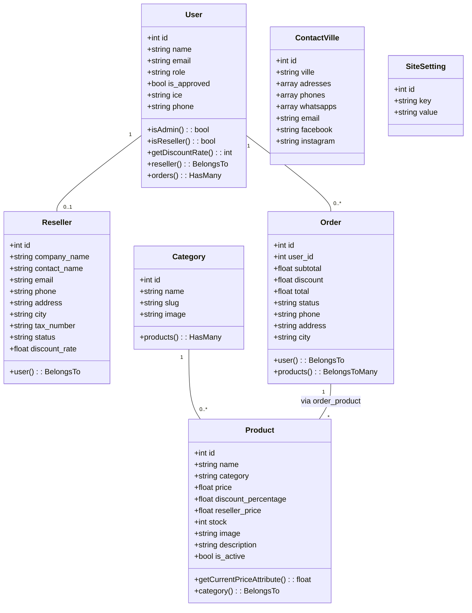
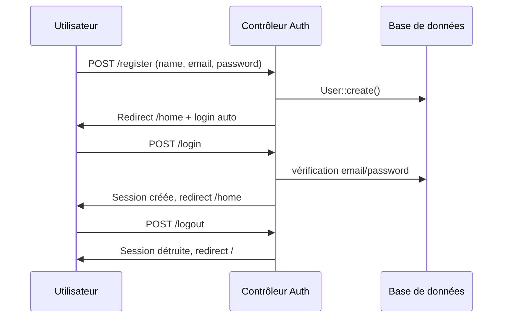

Voici le **rapport complet** d'architecture de votre application, incluant les diagrammes de classes (formats Mermaid) pour les modèles Eloquent et les contrôleurs principaux.

---

# 📦 Application Total Tools Maroc – Rapport d’architecture complet

## 1. Introduction

L’application est une plateforme e-commerce B2B/B2C développée avec **Laravel 11** + **React (Inertia.js)**.  
Elle gère :

- Un catalogue de produits avec **prix public** et **prix revendeur** (remise dynamique).
- Un système d’authentification multi‑rôles : **utilisateur**, **revendeur (reseller)**, **administrateur**.
- Un back‑office complet (administration des produits, commandes, demandes de revendeurs, points de vente, paramètres du site).
- Un processus de commande avec calcul automatique des remises et suivi de stock.

---

## 2. Schéma relationnel de la base de données


---

## 3. Diagrammes de classes (UML simplifié)

### 3.1 Modèles Eloquent



### 3.2 Contrôleurs principaux

```mermaid
classDiagram
    class ProductController {
        +index(Request $request)
        +create()
        +edit(Product $product)
        +store(Request $request)
        +update(Request $request, Product $product)
        +destroy(Product $product)
    }
    class AdminOrderController {
        +index()
        +updateStatus(Request $request, Order $order)
        +destroy(Order $order)
    }
    class AdminResellerController {
        +index()
        +approve(Request $request, Reseller $reseller)
        +reject(Reseller $reseller)
    }
    class OrderController {
        +userOrders()
        +show(Order $order)
        +index()   // page checkout
        +store(Request $request)
        +thanks($id)
    }
    class ResellerController {
        +index()
        +store(Request $request)
    }
    class ContactVilleController {
        +index()
        +store(Request $request)
        +update(Request $request, $id)
        +destroy($id)
    }
    class SiteSettingController {
        +index()
        +update(Request $request)
    }
    class LanguageController {
        +changeLanguage($lang)
    }
```



---

## 4. Logique métier essentielle

### 4.1 Prix dynamique (accessor `current_price`)

Fichier : `app/Models/Product.php`

```php
public function getCurrentPriceAttribute()
{
    if (Auth::check() && Auth::user()->isReseller()) {
        if ($this->reseller_price > 0) {
            return (float) $this->reseller_price;
        }
    }
    return (float) $this->price;
}
```

- **Utilisateur normal** → voit `price`.
- **Revendeur approuvé** → voit `reseller_price` (calculé automatiquement lors de la création/modification d’un produit).

### 4.2 Seeder des produits (`ProductSeeder`)

- Chaque produit est inséré avec :
  - `price` (prix public)
  - `discount_percentage` (exemple : 25)
  - `reseller_price = price - (price * discount_percentage / 100)`
- L’image est nommée à partir de la référence (ex : `TDLI205582.jpg`) et stockée dans `storage/app/public/products`.

### 4.3 Processus de commande

1. L’utilisateur ajoute des produits au panier (côté React).
2. Lors de la validation, `OrderController@store` :
   - Recalcule les prix à partir de la base (`current_price`).
   - Applique une remise de **10%** si le sous‑total > 10 000 MAD.
   - Crée la commande et associe les produits via la table pivot `order_product`.
   - Diminue le stock de chaque produit.

### 4.4 Demande de statut revendeur

- Formulaire → `ResellerController@store` → crée un enregistrement dans `resellers` avec `status = pending`.
- Admin peut **approuver** (avec un taux de remise personnalisé) ou **rejeter**.
- Une fois approuvé, l’utilisateur bénéficie des prix `reseller_price`.

---

## 5. Middlewares et localisation

| Middleware               | Rôle                                                                 |
|--------------------------|----------------------------------------------------------------------|
| `AdminMiddleware`        | Vérifie que l’utilisateur connecté a `role = admin`.                 |
| `SetLanguage`            | Lit `session('app_locale')` et configure Laravel (`App::setLocale`). |
| `HandleInertiaRequests`  | Partage globalement les traductions, points de vente, paramètres site et utilisateur courant. |

---

## 6. Flux d’authentification (diagramme de séquence)



---

## 7. Arborescence des répertoires clés

```
app/
├── Http/
│   ├── Controllers/
│   │   ├── Admin/
│   │   │   ├── ProductController.php
│   │   │   ├── AdminOrderController.php
│   │   │   ├── AdminResellerController.php
│   │   │   ├── ContactVilleController.php
│   │   │   └── SiteSettingController.php
│   │   ├── Auth/ (contrôleurs Breeze)
│   │   ├── OrderController.php
│   │   ├── ResellerController.php
│   │   ├── ProfileController.php
│   │   ├── LanguageController.php
│   │   └── ContactController.php
│   ├── Middleware/
│       ├── AdminMiddleware.php
│       ├── HandleInertiaRequests.php
│       └── SetLanguage.php
├── Models/
│   ├── User.php
│   ├── Reseller.php
│   ├── Product.php
│   ├── Category.php
│   ├── Order.php
│   ├── ContactVille.php
│   └── SiteSetting.php
├── Database/
│   ├── Migrations/ (tous les fichiers fournis)
│   └── Seeders/
│       └── ProductSeeder.php
```

---

## 8. Améliorations possibles (recommandations)

- **Paiement en ligne** : intégrer Stripe, CIH ou autre.
- **Cache** : mettre en cache `site_settings` et `contact_villes` pour réduire les requêtes.
- **Recherche avancée** : filtres par catégorie, prix, marque.
- **Gestion des stocks** : alertes en cas de quantité faible.
- **Logs d’activité** : enregistrer les actions admin.

---

## 9. Conclusion

L’application respecte le pattern MVC, utilise efficacement les fonctionnalités modernes de Laravel (Inertia, Eloquent, Middleware). Le système de prix revendeur est dynamique et sécurisé, l’administration est complète, et la structure permet une évolutivité aisée.

> 